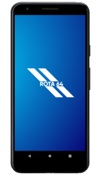
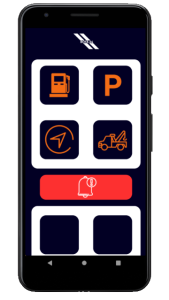

<h1># Rota 64 Hackathon CCR </h1>
### equipe:  
Fernando  
Bruno  
Vinicius  
Julia  
Lucas Cruz  
Miguel  

#### Objetivo Principal:
* Conectar os caminhoneiros aos pontos de parada nas rotas em que ele se encontra no momento,  
* facilitando dessa forma a qualidade de vida desses profissionais.

#### Tecnologias uTilizadas
  * para esse aplicativo optamos por desenvolver com a tecnologia react-native
  * O react-native foi ultilizado juntamente ao expo facilitando e ajilizando o desenvolvimento
  * foram ultilizadas bibliotecas de mapas e de roteamento entre telas disponibilizadas pelo npm
  
  
  
  
#### para um futuro da plataforma
  * Para o futuro pretendemos disponibilizar
    vouchers de abastecimento para caminhoneiros que sejam cadastrados e ativos na plataforma.
  
  * Pretendemos auxiliar os caminhoneiros sobre horários de circulação,
  conforme a região em que o motorista se encontra, oferecer um ponto de 
  parada próximo para melhorar o conforto do condutor.
